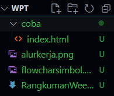
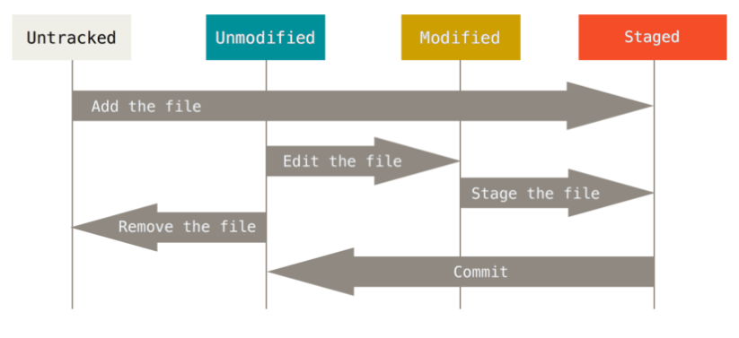
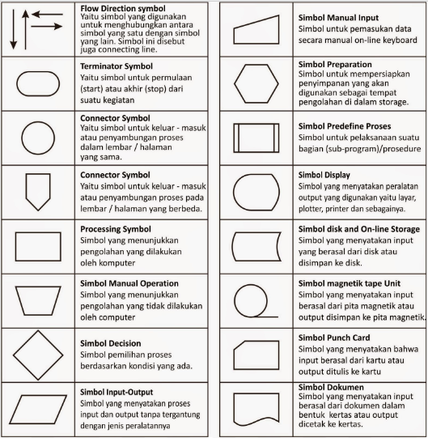

# Command Line Interface
## **Unix Command Line**
Unix Command Line atau Command Line Interface merupakan sebuah mekanisme yang dapat kita gunakan untuk berinteraksi dengan sistem operasi atau perangkat lunak komputer dengan menggunakan perintah tertentu yang dapat digunakan untuk melakukan sebuah tugas tertentu yang berbasis teks, ada beberapa contoh CLI, yaitu seperti sh, bash, zsh, cmd.exe.

## **File Structure**
File Structure disini merupakan bagaimana cara sistem operasi menyimpan file dan folder, dimana biasa sebuah file berada dalam sebuah folder dan folder tersebut bisa terdapat dalam sebuah folder dan seterusnya. File Structure juga dapat kita lihat dengan menggunakan perintah ls -R pada terminal.



diatas merupakan bentuk contoh file structure yang terdapat pada sebuah sistem dimana disini saya memberikan contoh diatas menggunakan Visual Studio Code, dimana file WPT yang berisi file seperti image alur kerja, flowcharsimbol dan beberapa file lainnya kemudian didalamnya juga terdapat folder coba, dimana didalam folder coba tersebut terdapat file index.html.

## **Shell**
sedangkan untuk shell tersebut, ini merupakan program yang menerima perintah jika kita sedang membicarakan tentang CLI, shell disini berguna untuk menerima perintah yang diberikan kemudian meneruskan perintah tersebut kepada system, shell tersebut berbentuk berbasis teks namun juga bisa berbasis grafis yang lebih dikenal dengan GUI (Graphical User Interface).
<br></br>

## **Terminal Emulator**
Terminal Emulator ini merupakan sebuah aplikasi yang bisa kita gunakan untuk mengakses cli.
<br></br>

## **Navigasi dalam CLI**
- "pwd" (Print Working Directory) ini merupakan command yang dapat kita gunakan untuk melihat direktori kita berada saat ini.
- "ls" (Lists) digunakan untuk melihat isi dari sebuah direktori.
- "cd" (Change Directory) digunakan untuk pindah ke direktori lain.
<br></br>

## **Manipulasi Files dan directory pada CLI**
- "touch" digunakan untuk membuat sebuah file
- "mkdir" digunakan untuk membuat sebuah direktori baru
- "head" dan "tail" digunakan untuk melihat beberapa line dari sebuah file text, dimana head untuk beberapa line awal sedangkan tail untuk akhiran
- "cat" digunakan untuk menggunakan melihat isi dari sebuah file
- "cp" digunakan untuk mengcopy file atau direktori, "cp -R" untuk menyalin sebuah direktori
- "mv" digunakan untuk memindahkan sebuah file atau direktori namun juga bisa digunakan untuk mengubah nama dari file maupun direktori, "mv -R" untuk     memindahkan direktori
- "rm" digunakan untuk menghapus file atau direktori, "rm -R" atau "rm -d" dapat digunakan untuk menghapus direktori
<br></br>
# Git & Github
Alasan mengapa kita harus menggunakan Git adalah karena Git merupakan salah satu sistem pengontrol versi (Version Control System) pada proyek perangkat lunak yang diciptakan oleh Linus Torvalds. Pada dasarnya, Git adalah sistem pengontrol versi terdistribusi, yang artinya setiap database Git di komputer lokal pengguna adalah salinan lengkap dari basis data Git itu sendiri. Git menyimpan data sebagai serangkaian snapshot dari file proyek (yang disebut commit), jadi Git sangat efisien dalam mengelola file yang memiliki ukuran besar. Sedangkan github merupakan sebuah layanan web yang menyediakan layanan hosting untuk proyek yang menggunakan sistem pengontrol versi Git dikarenakan hal tersebut seorang programmer harus menggunakan Git dan Github untuk melakukan kolaborasi bersama, tanpa perlu repot dalam mengcopy paste folder aplikasi secara berulang - ulang.
<br></br>
## **Perbedaan Git & Github**
Perbedaan dari Git dan Github, yaitu Git merupakan sebuah sistem pengontrol versi sedangkan Github merupakan sebuah layanan web yang menyediakan layanan hosting untuk proyek yang menggunakan sistem pengontrol versi Git.
<br></br>
## **Alur kerja Git**

diatas merupakan bagaiman cara alur kerja file didalam git, dimana file tersebut akan berubah menjadi sebuah commit, setelah itu commit tersebut akan di push ke github, dan setelah itu kita bisa melakukan pull request untuk mengubah file tersebut.

## **Command Git**
- "git init" digunakan untuk membuat sebuah repository baru
- "git remote add origin" digunakan untuk menambahkan remote repository
- "git add" digunakan untuk menambahkan file baru ke dalam repository
- "git commit" digunakan untuk menyimpan perubahan yang telah kita lakukan
- "git push" digunakan untuk mengirimkan perubahan yang telah kita lakukan ke dalam repository
- "git pull" digunakan untuk mengambil perubahan yang telah dilakukan oleh orang lain
- "git clone" digunakan untuk mengambil repository yang sudah ada
- "git status" digunakan untuk melihat status dari repository
- "git log" digunakan untuk melihat log dari repository
- "git diff" digunakan untuk melihat perbedaan dari file yang telah kita ubah
- "git push origin main" digunakan untuk mengirimkan perubahan yang telah kita lakukan ke dalam repository

<br></br>

# HTML
HTML merupakan sebuah singkatan dari Hypertext Markup Language, dimana HTML ini kita gunakan sebagai wadah yang dapat digunakan untuk menampilkan konten pada browser, namun sayangnya HTML disini bukan merupakan sebuah bahasa pemrograman yang berarti, dia tidak bisa dinamis mengolah data.

## **Tools Utama HTMl**
Terdapat 2 tools utama yang harus dipersiapkan dalam membuat HTML, 2 tool tersebut yaitu
- Text Editor (Sublime Text, Visual Studio Code, Atom, dll)
- Browser (Chrome, Firefox, Opera, dll)

## **Tag HTML**
- "html" digunakan untuk menandakan bahwa file tersebut merupakan sebuah file HTML
- "head" digunakan untuk menandakan bahwa file tersebut merupakan sebuah file HTML
- "body" digunakan untuk menandakan bahwa file tersebut merupakan sebuah file HTML
- "title" digunakan untuk menandakan bahwa file tersebut merupakan sebuah file HTML
- "h1" digunakan untuk menandakan bahwa file tersebut merupakan sebuah file HTML
- "p" digunakan untuk menandakan bahwa file tersebut merupakan sebuah file HTML
- "a" digunakan untuk menandakan bahwa file tersebut merupakan sebuah file HTML
- "img" digunakan untuk menandakan bahwa file tersebut merupakan sebuah file HTML
- "video" digunakan untuk menandakan bahwa file tersebut merupakan sebuah file HTML
- "ul" digunakan untuk menandakan bahwa file tersebut merupakan sebuah file HTML
- "ol" digunakan untuk menandakan bahwa file tersebut merupakan sebuah file HTML
- "li" digunakan untuk menandakan bahwa file tersebut merupakan sebuah file HTML
- "table" digunakan untuk menandakan bahwa file tersebut merupakan sebuah file HTML
- "tr" digunakan untuk menandakan bahwa file tersebut merupakan sebuah file HTML
- "td" digunakan untuk menandakan bahwa file tersebut merupakan sebuah file HTML
- "th" digunakan untuk menandakan bahwa file tersebut merupakan sebuah file HTML
- "form" digunakan untuk menandakan bahwa file tersebut merupakan sebuah file HTML
- "input" digunakan untuk menandakan bahwa file tersebut merupakan sebuah file HTML
- "button" digunakan untuk menandakan bahwa file tersebut merupakan sebuah file HTML
- "select" digunakan untuk menandakan bahwa file tersebut merupakan sebuah file HTML
- "option" digunakan untuk menandakan bahwa file tersebut merupakan sebuah file HTML
- "textarea" digunakan untuk menandakan bahwa file tersebut merupakan sebuah file HTML

## **Semanctic HTML**
Semanctic HTML merupakan sebuah tag yang digunakan untuk memberikan makna pada sebuah tag, sehingga kita bisa memahami tag tersebut dengan lebih baik, dan tag tersebut yaitu
- "header" digunakan untuk menandakan bahwa file tersebut merupakan sebuah file HTML
- "nav" digunakan untuk menandakan bahwa file tersebut merupakan sebuah file HTML
- "main" digunakan untuk menandakan bahwa file tersebut merupakan sebuah file HTML
- "section" digunakan untuk menandakan bahwa file tersebut merupakan sebuah file HTML
- "article" digunakan untuk menandakan bahwa file tersebut merupakan sebuah file HTML
- "aside" digunakan untuk menandakan bahwa file tersebut merupakan sebuah file HTML
- "footer" digunakan untuk menandakan bahwa file tersebut merupakan sebuah file HTML
- "figure" digunakan untuk menandakan bahwa file tersebut merupakan sebuah file HTML
- "figcaption" digunakan untuk menandakan bahwa file tersebut merupakan sebuah file HTML
- "details" digunakan untuk menandakan bahwa file tersebut merupakan sebuah file HTML
- "summary" digunakan untuk menandakan bahwa file tersebut merupakan sebuah file HTML
- "time" digunakan untuk menandakan bahwa file tersebut merupakan sebuah file HTML
- "mark" digunakan untuk menandakan bahwa file tersebut merupakan sebuah file HTML

diatas merupakan tag - tag yang dapat kita gunakan untuk mengimplementasikan semantic HTML.
<br></br>

# CSS
CSS dalam web Development berperan sebagai pengaturan tampilan dari sebuah website, dimana CSS ini dapat kita gunakan untuk mengatur tampilan dari sebuah website, seperti warna, ukuran, posisi, dll, namun sayangnya CSS ini tidak bisa dinamis mengolah data.
Contoh penggunaan CSS:
```css
body {
    background-color: #000;
    color: #fff;
}
```
diatas merupakan contoh penggunaan CSS, dimana kita mengatur background-color menjadi hitam dan color menjadi putih.

## **Penggunaan CSS**
Penggunaan CSS ini dapat kita gunakan dengan 2 cara, yaitu dengan inline CSS dan internal CSS, dimana cara tersebut dapat kita gunakan untuk mengatur tampilan dari sebuah website, namun sayangnya cara tersebut tidak dapat kita gunakan untuk mengatur tampilan dari sebuah website secara dinamis, karena cara tersebut hanya dapat mengatur tampilan dari sebuah website secara statis, kemudian selain itu juga terdapat cara ketiga yaitu External CSS dimana kita menyisipkan CSS dengan cara membuat file style css khusus yang kita sambungkan didalam tag head menggunakan tag src, Dan cara tersebut yaitu : 
- Inline CSS : Inline CSS ini dapat kita gunakan dengan cara menambahkan tag style pada tag html yang ingin kita atur tampilannya, dan cara tersebut dapat kita gunakan untuk mengatur tampilan dari sebuah website secara statis.
- Internal CSS : Internal CSS ini dapat kita gunakan dengan cara menambahkan tag style pada tag head yang ingin kita atur tampilannya, dan cara tersebut dapat kita gunakan untuk mengatur tampilan dari sebuah website secara statis.
- External CSS : External CSS ini dapat kita gunakan dengan cara membuat file style css khusus yang kita sambungkan didalam tag head menggunakan tag src, dan cara tersebut dapat kita gunakan untuk mengatur tampilan dari sebuah website secara dinamis.

## **Responsive CSS**
Responsive CSS ini merupakan sebuah CSS yang dapat kita gunakan untuk mengatur tampilan dari sebuah website secara dinamis, dimana responsive CSS ini dapat kita gunakan untuk mengatur tampilan dari sebuah website secara dinamis.
```css
@media screen and (max-width: 600px) {
    .column {
        width: 100%;
    }
}
```
diatas merupakan contoh penggunaan responsive CSS.

## **Flexbox**
Flexbox merupakan sebuah CSS yang dapat kita gunakan untuk mengatur tampilan dari sebuah website secara dinamis, dimana flexbox ini dapat kita gunakan untuk mengatur tampilan dari sebuah website secara dinamis.
```css
.container {
    display: flex;
    flex-direction: row;
    flex-wrap: wrap;
    justify-content: center;
    align-items: center;
    align-content: center;
}
```
diatas merupakan contoh penggunaan flexbox.
<br></br>

# Algorithm & Data Structure
Perbedaan dari Algorithm dan Data Structure yaitu :
- Algorithm : Algorithm merupakan sebuah cara untuk menyelesaikan sebuah masalah secara sistematis dan logis.
  Terdapat Beberapa penyajian Algorithm yaitu :
    - Pseudocode : penulisan ini dilakukan menyerupai penulisan pada kode pemrograman, contohnya seperti ini :
        ```pseudocode
        let a = 1
        let b = 2
        let c = a + b
        ```
        diatas merupakan contoh dari penulisan pseudocode, dimana kita mencoba membuat contoh penjumlahan dari 2 buah bilangan.
    - Flowchart  : penulisan ini dilakukan dengan menggunakan simbol-simbol sehingga lebih mudah dibaca, simbol-simbol yang digunakan tersebut adalah
        
    - Deskriptif : penulisan ini dilakukan dengan bahasa sehari-hari
        Contoh dari penulisan deskriptif yaitu :
        ```deskriptif
        1. Mulai
        2. Masukkan nilai a
        3. Masukkan nilai b
        4. Hitung nilai c = a + b
        5. Tampilkan nilai c
        6. Selesai
        ```
        diatas merupakan contoh dari penulisan deskriptif, dimana kita mencoba membuat contoh penjumlahan dari 2 buah bilangan.
- Data Structure : Data Structure merupakan sebuah cara untuk menyimpan dan mengorganisir data secara efisien.
  contoh penggunaan Data Structure :
    - Array : Array merupakan sebuah data structure yang dapat kita gunakan untuk menyimpan data secara berurutan, dan cara penggunaannya yaitu :
        ```array
        let arr = [1, 2, 3, 4, 5]
        ```
        diatas merupakan contoh penggunaan array, dimana kita mencoba membuat contoh array yang berisi 5 buah bilangan.
    - Object : Object merupakan sebuah data structure yang dapat kita gunakan untuk menyimpan data secara berpasangan, dan cara penggunaannya yaitu :
        ```object
        let obj = {
            nama: "Rizky",
            umur: 17,
            hobi: "Coding"
        }
        ```
        diatas merupakan contoh penggunaan object, dimana kita mencoba membuat contoh object yang berisi 3 buah data.

# Javascript
Javascript merupakan sebuah bahasa pemrograman yang dapat kita gunakan untuk membuat sebuah website menjadi lebih dinamis, dimana sebelum HTML belum dapat melakukan hal-hal yang dinamis, namun dengan adanya Javascript kita dapat membuat sebuah website menjadi lebih dinamis dikarenakan dengan javascript kita dapat melakukan pengolahan data.

## **Cara Merunning Javascript**
Salah satu cara yang dapat kita gunakan untuk menggunakan javascript pada sebuah website yaitu kita dapat menggunakan tag script pada tag head atau tag body, dan cara tersebut dapat kita gunakan untuk mengatur tampilan dari sebuah website secara dinamis, namun juga kita dapat langsung membuat file javascript khusus yang bisa langsung jalankan menggunakan browser yang kita miliki seperti Google Chrome, Mozilla Firefox, Microsoft Edge, dan lain-lain.

## **Variabel**
Variabel merupakan sebuah tempat yang dapat kita gunakan untuk menyimpan sebuah data, ada beberapa cara yang dapat kita gunakan untuk membuat sebuah variabel yaitu :
- var : var merupakan sebuah cara yang dapat kita gunakan untuk membuat sebuah variabel dalam javascript.
    ```var
    var nama = "Aal"
    ```
    diatas merupakan contoh penggunaan var, dimana kita mencoba membuat contoh variabel yang berisi nama.
- let : let merupakan sebuah cara yang dapat kita gunakan untuk membuat sebuah variabel dalam javascript dan merupakan versi yang lebih baru dimana let ini memiliki kelebihan dibandingkan dengan var mendukung global variabel dan local variabel.
    ```let
    let nama = "Aal"
    ```
    diatas merupakan contoh penggunaan let, dimana kita mencoba membuat contoh variabel yang berisi nama.
- const : const merupakan sebuah cara yang dapat kita gunakan untuk membuat sebuah variabel yang bersifat konstan, dimana kita tidak dapat mengubah nilainya
    ```const
    const nama = "Aal"
    ```
    diatas merupakan contoh penggunaan const, dimana kita mencoba membuat contoh variabel yang berisi nama.


## **Tipe Data Dalam Javascript**
Terdapat beberapa tipe data dalam javascript yaitu :
- Number : Number merupakan sebuah tipe data yang dapat kita gunakan untuk menyimpan data berupa angka, dan cara penggunaannya yaitu :
    ```javascript
    let a = 1
    ```
    diatas merupakan contoh penggunaan number, dimana kita mencoba membuat contoh number yang berisi 1.
- String : String merupakan sebuah tipe data yang dapat kita gunakan untuk menyimpan data berupa teks, dan cara penggunaannya yaitu :
    ```javascript   
    let a = "Aal"
    ```
    diatas merupakan contoh penggunaan string, dimana kita mencoba membuat contoh string yang berisi "Aal".
- Boolean : Boolean merupakan sebuah tipe data yang dapat kita gunakan untuk menyimpan data berupa true atau false, dan cara penggunaannya yaitu :
    ```javascript
    let a = true
    ```
    diatas merupakan contoh penggunaan boolean, dimana kita mencoba membuat contoh boolean yang berisi true.
- undefined : undefined merupakan sebuah tipe data yang dapat kita gunakan untuk menyimpan data yang belum diisi, dan cara penggunaannya yaitu :
    ```javascript
    let a
    ```
    diatas merupakan contoh penggunaan undefined, dimana kita mencoba membuat contoh undefined yang berisi data yang belum diisi.
- null : null merupakan sebuah tipe data yang dapat kita gunakan untuk menyimpan data yang kosong, dan cara penggunaannya yaitu :
    ```javascript
    let a = null
    ```
    diatas merupakan contoh penggunaan null, dimana kita mencoba membuat contoh null yang berisi data yang kosong.
- Object : Object merupakan sebuah tipe data yang dapat kita gunakan untuk menyimpan data berupa object, dan cara penggunaannya yaitu :
    ```javascript
    let a = {
        nama: "Aal",
        umur: 21,
        hobi: "Tidur"
    }
    ```
    diatas merupakan contoh penggunaan object, dimana kita mencoba membuat contoh object yang berisi 3 buah data.

## **Operator dalam Javascript**
Operator merupakan sebuah simbol yang dapat kita gunakan untuk melakukan operasi pada sebuah variabel, ada beberapa operator yang dapat kita gunakan dalam javascript yaitu :
- Arithmetic Operator : Arithmetic Operator merupakan sebuah operator yang dapat kita gunakan untuk melakukan operasi Arithmetic pada sebuah variabel, dan ada beberapa Arithmetic Operator yang dapat kita gunakan yaitu :
    - Penjumlahan (+) : Operator penjumlahan merupakan sebuah operator yang dapat kita gunakan untuk melakukan penjumlahan pada sebuah variabel, dan cara penggunaannya yaitu :
        ```javascript
        let a = 1
        let b = 2
        let c = a + b
        ```
        diatas merupakan contoh penggunaan operator penjumlahan, dimana kita mencoba membuat contoh penjumlahan yang berisi 1 + 2.
    - Pengurangan (-) : Operator pengurangan merupakan sebuah operator yang dapat kita gunakan untuk melakukan pengurangan pada sebuah variabel, dan cara penggunaannya yaitu :
        ```javascript
        let a = 1
        let b = 2
        let c = a - b
        ```
        diatas merupakan contoh penggunaan operator pengurangan, dimana kita mencoba membuat contoh pengurangan yang berisi 1 - 2.
    - Perkalian (*) : Operator perkalian merupakan sebuah operator yang dapat kita gunakan untuk melakukan perkalian pada sebuah variabel, dan cara penggunaannya yaitu :
        ```javascript
        let a = 1
        let b = 2
        let c = a * b
        ```
        diatas merupakan contoh penggunaan operator perkalian, dimana kita mencoba membuat contoh perkalian yang berisi 1 * 2.
    - Pembagian (/) : Operator pembagian merupakan sebuah operator yang dapat kita gunakan untuk melakukan pembagian pada sebuah variabel, dan cara penggunaannya yaitu :
        ```javascript
        let a = 1
        let b = 2
        let c = a / b
        ```
        diatas merupakan contoh penggunaan operator pembagian, dimana kita mencoba membuat contoh pembagian yang berisi 1 / 2.
    - Modulus (%) : Operator modulus merupakan sebuah operator yang dapat kita gunakan untuk melakukan modulus pada sebuah variabel, dan cara penggunaannya yaitu :
        ```javascript
        let a = 1
        let b = 2
        let c = a % b
        ```
        diatas merupakan contoh penggunaan operator modulus, dimana kita mencoba membuat contoh modulus yang berisi 1 % 2.
    - Increment (++) : Operator increment merupakan sebuah operator yang dapat kita gunakan untuk melakukan increment pada sebuah variabel, dan cara penggunaannya yaitu :
        ```javascript
        let a = 1
        a++
        ```
        diatas merupakan contoh penggunaan operator increment, dimana kita mencoba membuat contoh increment yang berisi 1++.
    - Decrement (--) : Operator decrement merupakan sebuah operator yang dapat kita gunakan untuk melakukan decrement pada sebuah variabel, dan cara penggunaannya yaitu :
        ```javascript
        let a = 1
        a--
        ```
        diatas merupakan contoh penggunaan operator decrement, dimana kita mencoba membuat contoh decrement yang berisi 1--.
- Comparison Operator : Comparison Operator merupakan sebuah operator yang dapat kita gunakan untuk melakukan perbandingan pada sebuah variabel, dan ada beberapa Comparison Operator yang dapat kita gunakan yaitu :
    - Lebih Besar dari (>) : Operator lebih besar dari merupakan sebuah operator yang dapat kita gunakan untuk melakukan perbandingan lebih besar dari pada sebuah variabel, dan cara penggunaannya yaitu :
        ```javascript
        let a = 1
        let b = 2
        let c = a > b
        ```
        diatas merupakan contoh penggunaan operator lebih besar dari, dimana kita mencoba membuat contoh perbandingan lebih besar dari yang berisi 1 > 2.
    - Lebih Kecil dari (<) : Operator lebih kecil dari merupakan sebuah operator yang dapat kita gunakan untuk melakukan perbandingan lebih kecil dari pada sebuah variabel, dan cara penggunaannya yaitu :
        ```javascript
        let a = 1
        let b = 2
        let c = a < b
        ```
        diatas merupakan contoh penggunaan operator lebih kecil dari, dimana kita mencoba membuat contoh perbandingan lebih kecil dari yang berisi 1 < 2.
    - Lebih Besar dari Sama Dengan (>=) : Operator lebih besar dari sama dengan merupakan sebuah operator yang dapat kita gunakan untuk melakukan perbandingan lebih besar dari sama dengan pada sebuah variabel, dan cara penggunaannya yaitu :
        ```javascript
        let a = 1
        let b = 2
        let c = a >= b
        ```
        diatas merupakan contoh penggunaan operator lebih besar dari sama dengan, dimana kita mencoba membuat contoh perbandingan lebih besar dari sama dengan yang berisi 1 >= 2.
    - Lebih Kecil dari Sama Dengan (<=) : Operator lebih kecil dari sama dengan merupakan sebuah operator yang dapat kita gunakan untuk melakukan perbandingan lebih kecil dari sama dengan pada sebuah variabel, dan cara penggunaannya yaitu :
        ```javascript
        let a = 1
        let b = 2
        let c = a <= b
        ```
        diatas merupakan contoh penggunaan operator lebih kecil dari sama dengan, dimana kita mencoba membuat contoh perbandingan lebih kecil dari sama dengan yang berisi 1 <= 2.
    - Sama Dengan (===) : Operator sama dengan merupakan sebuah operator yang dapat kita gunakan untuk melakukan perbandingan sama dengan pada sebuah variabel, dan cara penggunaannya yaitu :
        ```javascript
        let a = 1
        let b = 2
        let c = a === b
        ```
        diatas merupakan contoh penggunaan operator sama dengan, dimana kita mencoba membuat contoh perbandingan sama dengan yang berisi 1 === 2.
    - Tidak Sama Dengan (!==) : Operator tidak sama dengan merupakan sebuah operator yang dapat kita gunakan untuk melakukan perbandingan tidak sama dengan pada sebuah variabel, dan cara penggunaannya yaitu :
        ```javascript
        let a = 1
        let b = 2
        let c = a !== b
        ```
        diatas merupakan contoh penggunaan operator tidak sama dengan, dimana kita mencoba membuat contoh perbandingan tidak sama dengan yang berisi 1 !== 2.
- Logical Operator : Logical Operator merupakan sebuah operator yang dapat kita gunakan untuk melakukan operasi logika pada sebuah variabel, dan ada beberapa Logical Operator yang dapat kita gunakan yaitu :
    - AND (&&) : Operator AND merupakan sebuah operator yang dapat kita gunakan untuk melakukan operasi logika AND pada sebuah variabel, dan cara penggunaannya yaitu :
        ```javascript
        let a = 1
        let b = 2
        let c = a && b
        ```
        diatas merupakan contoh penggunaan operator AND, dimana kita mencoba membuat contoh operasi logika AND yang berisi 1 && 2.
    - OR (||) : Operator OR merupakan sebuah operator yang dapat kita gunakan untuk melakukan operasi logika OR pada sebuah variabel, dan cara penggunaannya yaitu :
        ```javascript
        let a = 1
        let b = 2
        let c = a || b
        ```
        diatas merupakan contoh penggunaan operator OR, dimana kita mencoba membuat contoh operasi logika OR yang berisi 1 || 2.
    - NOT (!) : Operator NOT merupakan sebuah operator yang dapat kita gunakan untuk melakukan operasi logika NOT pada sebuah variabel, dan cara penggunaannya yaitu :
        ```javascript
        let a = 1
        let b = 2
        let c = !a
        ```
        diatas merupakan contoh penggunaan operator NOT, dimana kita mencoba membuat contoh operasi logika NOT yang berisi !1.

## **Control Flow**
Control Flow merupakan sebuah cara untuk mengatur alur program kita, dan ada beberapa cara untuk mengatur alur program kita yaitu :
- Conditional : Conditional merupakan sebuah cara untuk mengatur alur program kita dengan menggunakan sebuah percabangan yang menggambarkan sebuah kondisi, terdapat beberapa cara yang dapat kita gunakan cara nya adalah :
    - If Statement
    - If Else Statement
    - If Else If Statement
    - Switch Statement
    - Truthy dan Falsy 
    - Ternary Operator
- Looping : Looping merupakan sebuah cara untuk mengatur alur program kita dengan menggunakan sebuah perulangan yang dapat kita atur menggunakan beberapa kondisi, terdapat beberapa cara yang dapat kita gunakan cara nya adalah :
    - For Loop
    - While Loop
    - Do While Loop
    - For In Loop
    - For Of Loop


